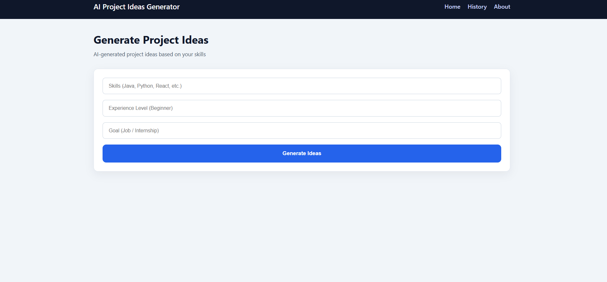
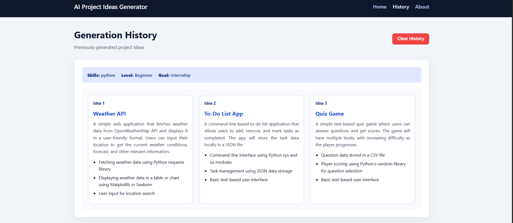
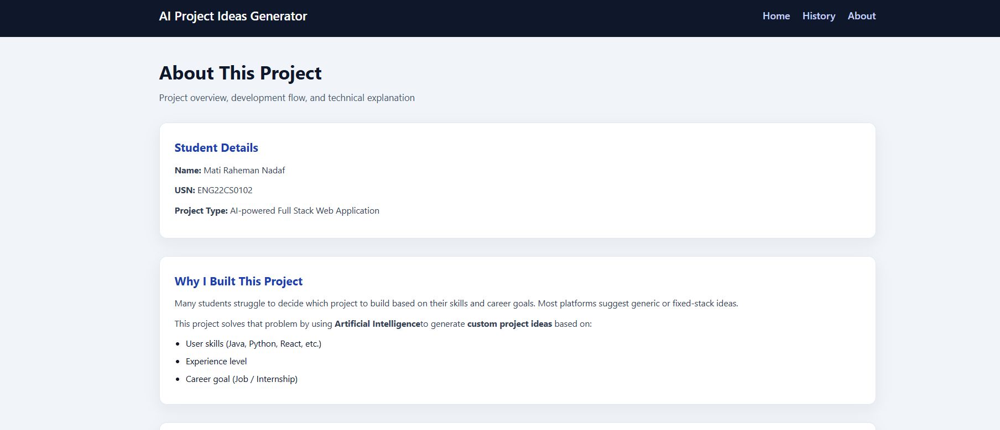

# 🤖 AI Project Ideas Generator

An **AI-powered full-stack web application** that generates **personalized software project ideas** based on a user’s **skills**, **experience level**, and **career goal**.  
This project demonstrates **AI integration, full-stack development, clean UI design, and real-world problem solving**.

---

## 👨‍🎓 Student Details

- **Name:** Mati Raheman Nadaf  
- **USN:** ENG22CS0102  
- **Course:** Computer Science & Engineering  
- **Project Type:** AI + Full Stack Web Application  

---

## 📌 Problem Statement

Many students struggle to decide:
- Which project to build?
- Whether the project matches their skill level?
- If the project is suitable for internships or jobs?

Most existing platforms provide **generic, fixed-stack project ideas** and do not adapt to individual users.

---

## 💡 Solution

This application uses **Artificial Intelligence** to:
- Take **user skills** (Java, Python, React, etc.)
- Take **experience level** (Beginner / Intermediate)
- Take **career goal** (Job / Internship)
- Generate **custom project ideas dynamically**
- Store previous generations for future reference

---

## ✨ Key Features

- AI-generated project ideas (dynamic & personalized)
- Supports **any technology stack** (not limited to MERN)
- Clean, professional UI
- History tracking using MongoDB
- Clear history functionality
- Local AI model (no paid APIs)
- Interview & academic project ready

---

## 🛠️ Tech Stack

### Frontend
- React (Vite)
- React Router
- Custom CSS

### Backend
- Node.js
- Express.js

### Database
- MongoDB

### AI
- **LLaMA 3 (Local AI Model)**
- Ollama (runs AI locally)

---

## 🧠 How the Project Works (High-Level Flow)

1. User enters skills, experience level, and goal
2. Frontend sends request to backend API
3. Backend builds a dynamic AI prompt
4. AI generates project ideas
5. Backend stores result in MongoDB
6. Frontend displays structured output
7. History page fetches previous records

---

## 🧩 Detailed Working Explanation

### Frontend (React)
- Collects user input
- Sends API request using `fetch`
- Displays results in card-based UI
- Handles loading and error states

### Backend (Node.js + Express)
- Receives user input
- Generates dynamic prompt
- Calls AI model via Ollama
- Saves data in MongoDB
- Provides history & delete APIs

### AI Integration
- Uses **local LLaMA 3 model**
- No API key or billing required
- Prompt adapts based on user input
- Ensures structured and readable output

### Database (MongoDB)
- Stores:
  - Skills
  - Level
  - Goal
  - AI response
  - Timestamp
- Enables history view & clear history feature

---

## 📸 Screenshots

### Home Page – Generate Project Ideas


### History Page – Stored AI Outputs


### About Page


---

## 🚀 Installation & Setup

### Prerequisites
- Node.js
- MongoDB (local or Atlas)
- Ollama installed
- LLaMA 3 model pulled

```bash

Backend Setup
cd backend
npm install
node index.js

Frontend Setup
cd frontend
npm install
npm run dev


